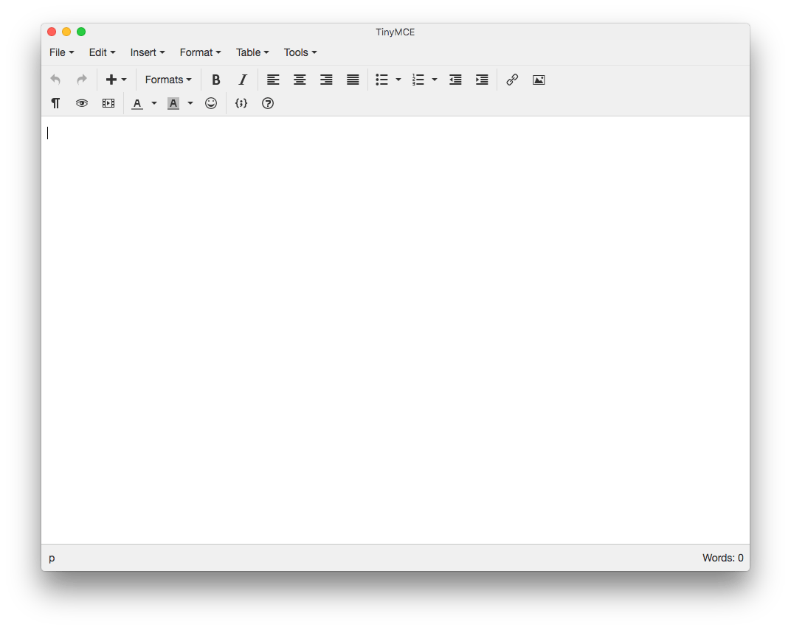

# Standalone TinyMCE for macOS

#### A very simple TinyMCE app created with PhoneGap

Sometimes you need to visually edit a bit of rich formatted text which needs to
be in HTML format. You might want to add some tidy formatting to a Gmail
message or to compose a richer note to paste into Evernote.

Word processors are not suitable for this task because the code they produce is
very messy. However, TinyMCE has proven to be an amazing tool for WYSIWYG HTML
editing. This app is a lightweight wrapper for a full featured, resizable
TinyMCE instance that can be used offline.

## Usage

#### PhoneGap CLI

You can build the project with:

    phonegap build osx

Then run it with:

    phonegap run osx

The `patch` directory contains some files that are replaced in the Xcode project.

## License

The code of this project is release under the [GPL v3 license](LICENSE).

### Notice

This product includes software developed at The Apache Software Foundation
(<http://www.apache.org/>).

[Apache Cordova](https://cordova.apache.org/) is released under the terms of the
[Apache 2.0 license](misc/Apache2.txt).

[TinyMCE](https://www.tinymce.com/) is released under the terms of the [LGPL
v2.1 license](www/js/tinymce/license.txt).

### Icon

The app icon is provided by the great [Icons8](https://icons8.com/) project! It
is distributed under the terms of the [Creative Commons Attribution-NoDerivs 3.0
Unported](https://creativecommons.org/licenses/by-nd/3.0/) license.
